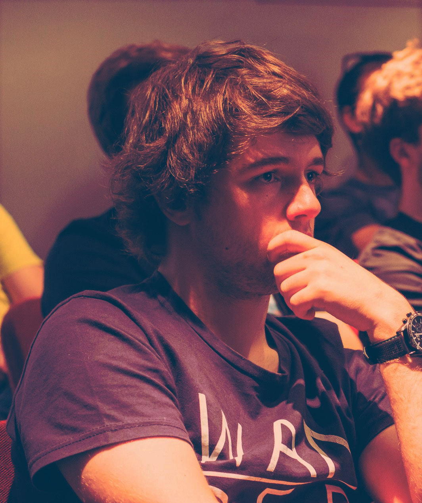

## About Me

- *Engineer. Developer. Photography and design enthusiast.* 

Currently working as a researcher on the thin line between hardware and software. Graduated from the Integrated Masters in Informatics and Computing Engineering by Faculty of Engineering, University of Porto. Passionate about technology in general, with a special focus on security and privacy, web development, data mining & Internet of Things. Furthermore, an amateur photographer, football player, book lover and science addict.

#### Work & Study

- Researcher @ INESC TEC - Porto
- Invited Assistant Professor @ FEUP - Porto
- PhD Candidate @ Doctoral Program in Informatics Engineering

## Research Interests

- Software Engineering
    - Design Patterns, Development Methodologies, Software Development Life-cycle, Edge/Fog/Cloud Computing
- Internet-of-Things
    - Systems of Systems, Reference Architectures, Development Toolkits and IDEs
- Security & Privacy

## Recent Publications





 

  {{ counter }}. <a href="{{ pub.url }}">**{{ pub.title }}**</a>, {{ pub.authors }}  
  - {{ pub.conference }}, {{ pub.year }}



<a href="/publications"> - **View Other Publications**</a>